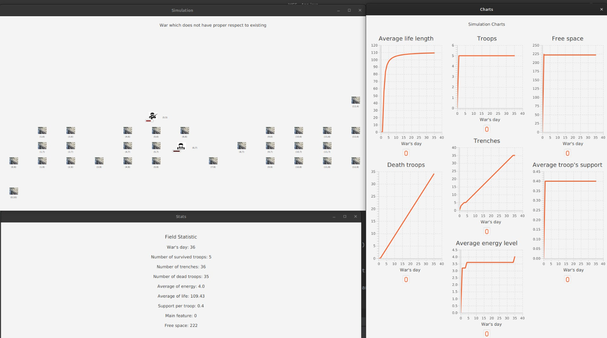

<!DOCTYPE html>
<html lang="en">
<head>
    <meta charset="UTF-8">
    <meta name="viewport" content="width=device-width, initial-scale=1.0">
</head>
<body>

<h1>World Conflict Simulator</h1>

Welcome to the World Conflict Simulator project. This application, built using Maven and JavaFX, simulates conflicts between different entities in a world setting.

<h2>Table of Contents</h2>
<ul>
    <li><a href="#description">Description</a></li>
    <li><a href="#features">Features</a></li>
    <li><a href="#installation">Installation</a></li>
    <li><a href="#usage">Usage</a></li>
    <li><a href="#contributing">Contributing</a></li>
    <li><a href="#license">License</a></li>
</ul>

<h2 id="description">Description</h2>

The World Conflict Simulator is designed to provide a dynamic simulation environment where users can create and manage conflicts between different world entities. The application offers a variety of features to customize and control the simulation.

<h2 id="features">Features</h2>
<ul>
    <li>Interactive map interface</li>
    <li>Customizable entities and scenarios</li>
    <li>Real-time conflict simulation</li>
    <li>Statistical analysis and reporting</li>
</ul>

<h2 id="installation">Installation</h2>

To install and run the World Conflict Simulator, download the directory from this repository and use it on your IDE or follow these steps:

<ol>
    <li>Ensure you have <a href="https://maven.apache.org/">Maven</a> and <a href="https://www.oracle.com/java/technologies/javase-jdk11-downloads.html">Java Development Kit (JDK) 11</a> installed on your system.</li>
    <li>Clone the repository:</li>
    <pre><code>git clone https://github.com/yourusername/world-conflict-simulator.git</code></pre>
    <li>Navigate to the project directory:</li>
    <pre><code>cd world-conflict-simulator</code></pre>
    <li>Build the project using Maven:</li>
    <pre><code>mvn clean install</code></pre>
    <li>Run the application:</li>
    <pre><code>mvn javafx:run</code></pre>
</ol>

<h2 id="usage">Usage</h2>

After starting the application, you will be greeted with the main interface. Here are some basic steps to get started:

<ol>
    <li>Select or create entities to include in the simulation.</li>
    <li>Set up the initial conditions for the conflict.</li>
    <li>Start the simulation and observe the outcomes.</li>
    <li>Analyze the results using the built-in statistical tools.</li>
</ol>

<h2>Screenshots</h2>

Here are some screenshots of the World Conflict Simulator in action:

<h2 id="contributing">Contributing</h2>

If you wish to contribute to the project, please follow these guidelines:

<ol>
    <li>Fork the repository.</li>
    <li>Create a new branch for your feature or bugfix:</li>
    <pre><code>git checkout -b feature-name</code></pre>
    <li>Make your changes and commit them:</li>
    <pre><code>git commit -m "Description of your changes"</code></pre>
    <li>Push to the branch:</li>
    <pre><code>git push origin feature-name</code></pre>
    <li>Create a pull request on GitHub.</li>
</ol>
</body>
</html>
